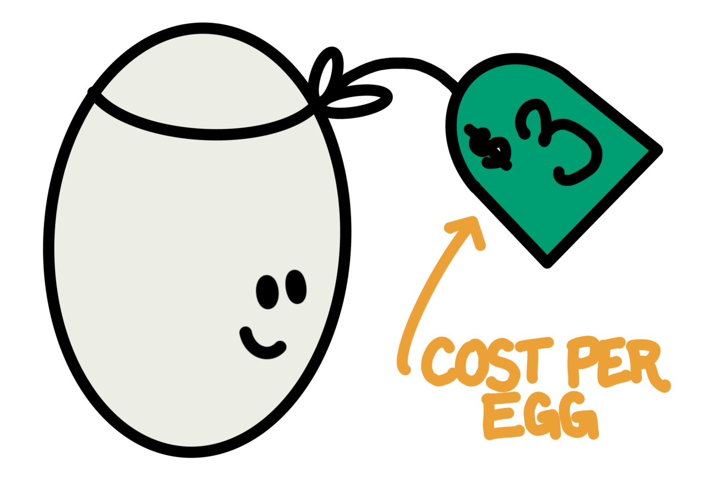
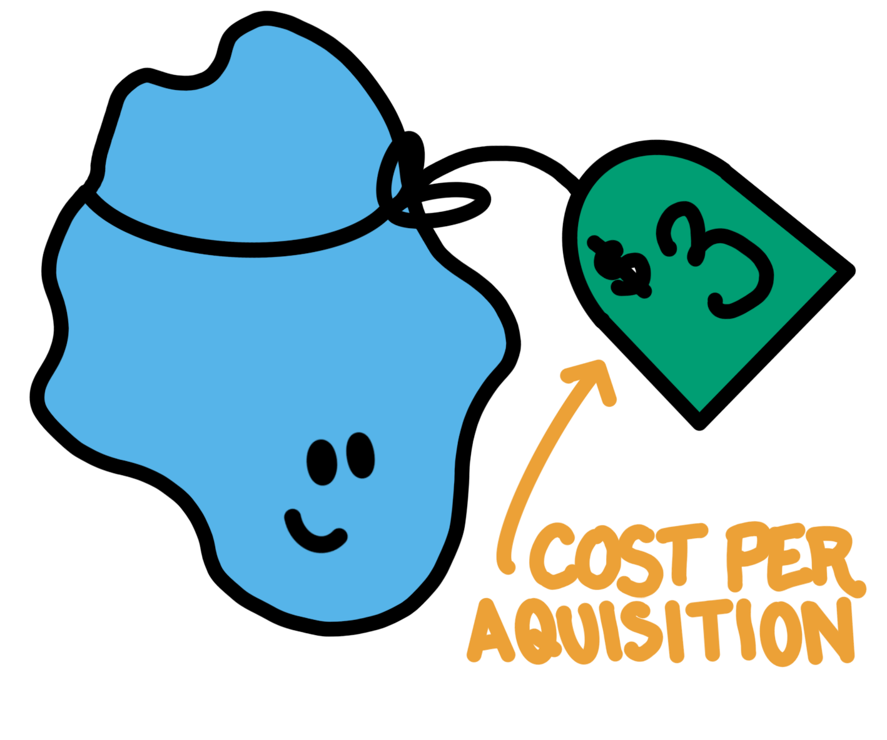
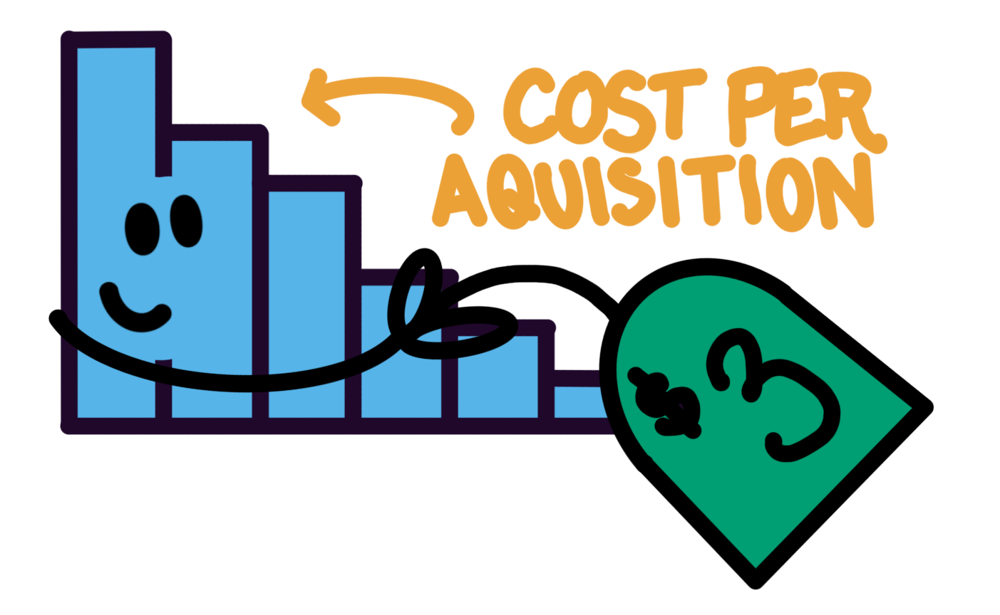

In marketing analytics there are two numbers that matter:

-   **ROI** (Return on Investment)
-   **CPA** (Cost per Acquisition)

ROI is intuitive to think about: it's a revenue multiplier on spend (e.g. you'll spend `x` you'll get 1.2`x` back), CPA is not. The way we talk about CPA in marketing is as a cost: a price-tag on a conversion. If we pay the cost, we'll get a conversion, just like if we pay \$3 we can get an egg at Trader Joe's.

:::: {style="width: 60%; margin: 0 auto;"}
::: {layout="[30,30]"}
{width="423"}

{width="394"}
:::
::::

But CPA is really a *rate*. How many exposures do we need to pay for before we get a conversion? Let's simplify: an exposure costs \$0.10. A CPA of \$3 means that on average it took 300 exposures before we got a conversion.

{fig-align="center" width="328"}

Say we spent \$1,000 per day for 30 days and saw 0 conversions. When we think about CPA as a **cost** we might see the \$1,000 in spend per day and 0 conversions and conclude that our CPA is probably higher than \$1,000. It's like the world's worst store, we walked up to the till each day, paid \$1,000, hoped that was more than the price-tag on a conversion, and left disappointed. But, when we think about CPA as a **rate** we see \$1,000 worth off exposures *every day* over 30 days with 0 conversions, a *much* bleaker picture.

Framed as a rate, what we saw was 300,000 exposures (\$30,000) with 0 conversions. The cost per conversion is likely more than *\$30,000* (not \$1,000). If the CPA was \$1,000 we should see a conversion every 10,000 exposures (see Figure 1, there's \~90% chance we'll get 24+ conversions at a \$1,000 CPA. Whereas at a *\$30,000* CPA, we often see 0 or only a few conversions) or so, but across 300,000 exposures we actually saw 0.

```{r}
#| label: fig-binomial-1
#| fig-cap: "Expected conversions over 30 days of exposures (10,000 per day: $1,000 worth at $0.10 each) "
#| fig-width: 6
#| fig-height: 4
#| warning: false

library(ggplot2)
library(patchwork)

plot_binomial <- function(n, p, min, max) {
  k <- 0:n
  prob <- dbinom(k, size = n, prob = p)
  
  df <- data.frame(k = k, prob = prob)
  
  ggplot(df, aes(x = k, y = prob)) +
    geom_col(fill = "#56B4E9") +
    labs(
      title = "Expected Conversions",
      subtitle = sprintf("(total exposures = %.0fK, p(conversion) = %.6f)", n/1000, p),
      x = "number of conversions",
      y = "P(X = k)"
    ) +
    theme_minimal(base_size = 13) +
    theme(
      panel.grid.major = element_blank(),
      panel.grid.minor   = element_blank(),
      plot.title         = element_text(face = "bold"),
      plot.subtitle      = element_text(color = "grey50"),
      axis.text.y = element_blank(),
      axis.ticks.y = element_blank()
    ) + 
    xlim(c(min,max))
}

# example call
x <- plot_binomial(n = 300000, p = 1/10000,20,40)
y <- plot_binomial(n = 300000, p = 1/300000,0,10)
x/y
```

This framing also explains why we can have a CPA of \$100 and still see 3 conversions on \$150 of spend (we just got lucky).

```{r}
#| label: fig-binomial-2
#| fig-cap: "Expected conversions for $150 of spend with a true CPA of $100 "
#| fig-width: 6
#| fig-height: 4
#| warning: false

library(ggplot2)
library(patchwork)

plot_binomial <- function(n, p, min, max, hl = 3) {
  k <- 0:n
  prob <- dbinom(k, size = n, prob = p)
  
  df <- data.frame(k = k, prob = prob)
  df$highlight <- ifelse(k == hl, "yes", "no")
  
  ggplot(df, aes(x = k, y = prob, fill = highlight)) +
    geom_col() +
      scale_fill_manual(values = c("yes" = "#009E73", "no" = "#56B4E9"), guide = "none") +
    labs(
      title = "Expected Conversions",
      subtitle = sprintf("(total exposures = %.1fK, p(conversion) = %.6f)", n/1000, p),
      x = "number of conversions",
      y = "P(X = k)"
    ) +
    theme_minimal(base_size = 13) +
    theme(
      panel.grid.major = element_blank(),
      panel.grid.minor   = element_blank(),
      plot.title         = element_text(face = "bold"),
      plot.subtitle      = element_text(color = "grey50"),
      axis.text.y = element_blank(),
      axis.ticks.y = element_blank()
    ) + 
    xlim(c(min,max))
}

# example call
x <- plot_binomial(n = 150/0.1, # 0.10 per conversion
                   p = 1/(100/0.1), # expect conversion every 100/0.1 exposures
                  0,10)
x
```

Marketing spend is more complicated than this. We don't always pay a flat rate for exposures and exposures are not the same quality as we scale spend, but the framing stands. We should encourage people to talk about CPAs as **rates**, not as **costs** because it makes interpreting CPAs more intuitive. It also highlights the mechanisms for improving CPA:

-   improve the *rate* of conversions (e.g. better targeting, quality creative)
-   reduce the *cost* of an exposure (idk, bully Meta a little?)

::: {.callout-note title="AI disclosure"}
🤖 **Used AI for:** AI used for blog template and plotting code.

**🧍🏻‍♀️Did not use AI for:** ideas and written blog content.
:::
